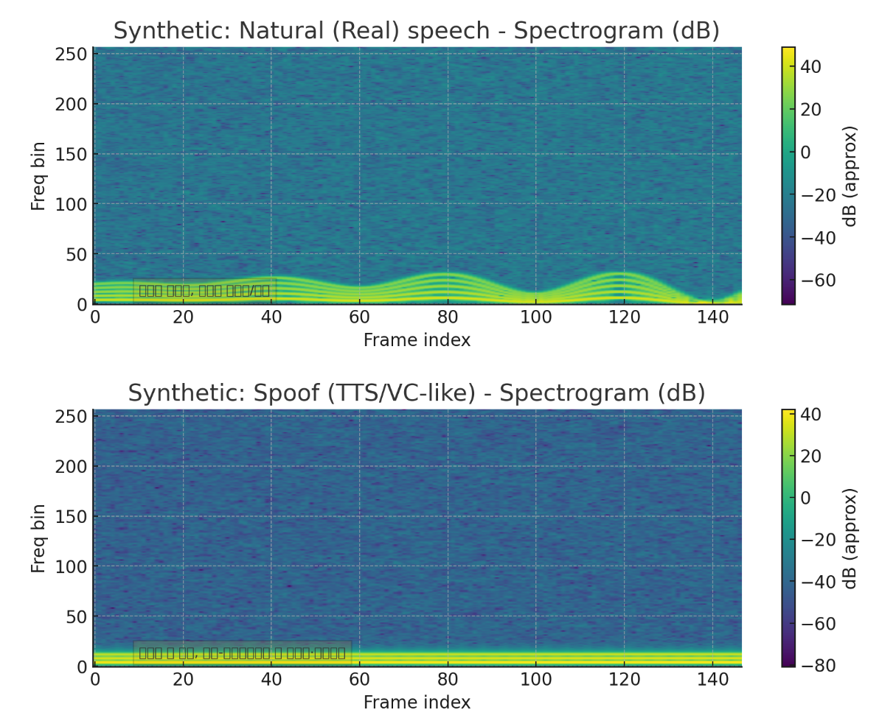

# **핵심 요약**

- 분류기는 **오디오 → Whisper FeatureExtractor(로그-멜/입력 피처) → Whisper Encoder(트랜스포머)**로 얻은 시공간 임베딩의 통계적/학습된 차이를 학습한 MLP가 이진(실제 vs 변조) 로짓을 출력하는 방식으로 작동
- 변조 음성은 보통 스펙트럼·시간적 미세변화(미세 호흡, jitter/shimmer 등)가 부족하거나 인위적/주기적인 아티팩트가 있고, 이 차이가 임베딩에 반영되어 분류기가 구별

# **1. 모델 관점**

- FeatureExtractor (log-mel / input_features)
  - 원시 파형을 로그-멜(또는 모델이 요구하는 형태)의 시간-주파수 표현으로 변환.
  - 실제 음성의 미세한 잡음·호흡·고조파 변화는 이 표현에 나타남.
- Whisper Encoder (Transformer)
  - 시간 축과 주파수 축의 문맥(phonetic, prosodic, spectral pattern)을 포착한 고차원 임베딩을 생성.
  - 트랜스포머의 여러 레이어는 국소(프레이즈 단위)와 장기(문장 단위) 패턴을 모두 인코딩.
- Pooling → MLP (분류기)
  - 시간축 평균(또는 다른 pooling)을 통해 고정 길이 벡터로 요약.
  - 이 요약 벡터의 통계적 분포(예: 스펙트럼 에너지 분포, 에너지 변화, 주파수별 불규칙성 등)가 실제/변조 음성에서 다르게 나타나며 MLP가 그 차이를 학습.

# **2. 음향학적(신호) 차이 — 변조(스푸핑) vs 실제 음성**

A. 스펙트럼 특성

- 고조파 구조 (harmonics)
  - 실제 음성: 기본주파수(f0)와 그 고조파들이 시간에 따라 자연스럽게 흔들림(미세한 주파수 변동).
  - 변조(TTS/VC 등): 고조파가 더 규칙적이고 일정하거나, 오히려 고조파가 약화되어 보일 수 있음(스펙트럼이 평탄·부드러움).
- 스펙트럼 엔트로피 / 세부 잡음
  - 실제 음성은 호흡·마찰음·주변 잡음 등으로 미세한 고주파 성분(비조화 성분)이 존재.
  - 합성음/보코더 기반 음성은 고주파 성분이 적거나 특정 주파수 대역이 과도하게 평활화되어 있음.

B. 시간-주파수(temporal) 특성

- 미세한 발성 변화 (micro-prosody)
  - 실제 사람 음성은 초단위보다 더 짧은 간격에서도 힘(RMS), 주파수, 위상에 '작은 변동'이 있음.
  - TTS/VC는 이런 미세 불규칙성이 부족하거나 지나치게 규칙적.
- 전환(transitions)
  - 실제음성: 자음-모음 전환의 스펙트럼 변화가 자연스럽고 불규칙함.
  - 합성음: 전환이 더 매끄럽거나 반대로 인공적이면 과하게 날카로움.

C. 주기성 / 위상

- 주기성 및 위상 일관성
  - 재생(replay) 공격은 녹음-재생 과정에서 위상 왜곡·대역감쇠·리버브(RIR) 등을 남김.
  - TTS/VC는 내부 모델의 위상 재구성 방식 때문에 특정 주파수대에서 비정상적 위상 특징을 보일 수 있음(Whisper의 특성상 진폭·주파수 특성에 더 민감).

D. 기타 아티팩트

- 보컬 노이즈(호흡, 입술 소리): 실제 음성에 더 풍부함.
- 코덱·인코딩 아티팩트: 재생 공격 또는 전달 경로에서 생김(특정 주파수 대역 줄어듦, 잡음 패턴).
- 스펙트럼 스무딩: 보코더, 그리폰(griffon)류 vocoder는 스펙트럼을 과도하게 평활화.

# **3. 스펙트럼에서의 직관적 징후(그림 기준)**

- Real 스펙트로그램(그림):

  - 시간에 따라 고조파 밴드가 약간씩 흔들리고(비주기적 변동), 고주파 대역에 미세한 '노이즈 성분'이 존재.
  - 폰엠 전환 구간(자음→모음)에서 불규칙한 에너지 변화가 보임.

- Spoof 스펙트로그램(그림):
  - 고조파 수가 적거나 밴드가 더 가늘고 규칙적.
  - 고주파 에너지(잡음)가 적고, 시간축으로 매끄럽게 이어지는 패턴이 많아 '인공적'으로 보일 수 있음.

# **4. 모델이 구체적으로 배우는 신호 특징**

- 스펙트럴 스무딩 지표: 멜밴드 간 차이의 분산(작으면 합성 가능성↑).
- 주파수별 에너지 변화량: 실제는 더 많은 프레임간 변동.
- Pitch contour variance (f0 variance): 낮으면 합성 의심.
- Harmonics-to-noise ratio (HNR): 너무 높거나 너무 일정하면 합성 의심.
- High-frequency energy ratio: 재생 또는 녹음-재생 아티팩트는 고주파 대역 감쇠로 드러남.

Whisper encoder의 임베딩은 이러한 통계들을 복합적으로 압축하여 표현하므로, 단일 지표보다 임베딩 공간에서의 분포 차이를 MLP가 학습.

# **5. 평가 지표**

- AUC, EER (Equal Error Rate), FAR / FRR 및 공격별(attack-wise) 성능 보고.
- 실서비스에서는 false positive(정상→스푸핑)와 false negative(스푸핑→정상)의 비용이 다르므로 운영 임계값을 적절히 선택.

# **6. 한계**

- 통계적 탐지
  - 공격자가 탐지를 의식해 보정하면 (예: vocoder 개선, 잡음 추가, adversarial fine-tuning) 탐지 정확도가 떨어질 수 있음.
  - 계속해서 새로운 공격 데이터를 수집·재학습하는 파이프라인 필요할 수 있음.
