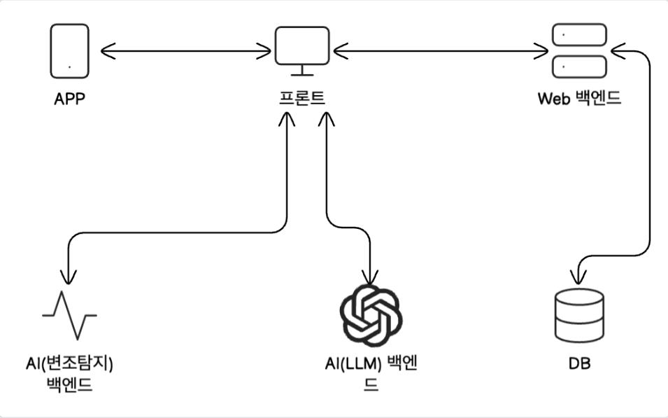

# **보이스 피싱 탐지 프로젝트**

### **프로젝트 개요 파일**

- Team Aura\_발표자료.pdf
  - 프로젝트 소개와 프로젝트에 대한 발표 내용
- Aura.pdf
  - 프로젝트의 피그마 시트
- Aura_testcase.xlsx
  - 프로젝트의 테스트 시트

### **전체 프로젝트 구조(각 세부내용은 각 폴더내의 README.md 확인)**

- 프론트엔드(voiceFront 폴더)
  - React와 Next.js로 구성
- 웹 백엔드(voiceBack 폴더)
  - SpringBoot로 구성
- AI 백엔드(ModelBackEnd 폴더)
  - 파이썬 FastAPI로 구성
- APP(auraAPP 폴더)
  - 네이티브 웹뷰 어플로 구성

