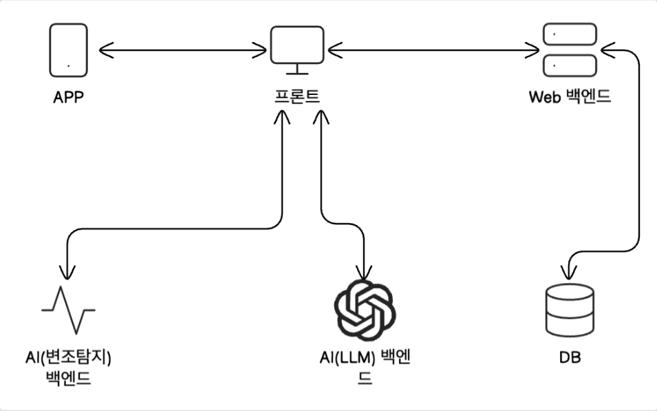

# **보이스 피싱 탐지 프로젝트**

### **핵심기능**

- whisper모델을 튜닝하여 만든 실시간 음성 변조 탐지 기능
- pynote모델과 whisper STT 모델을 이용한 화자분리와 대화내용 출력
- Qwen LLM 모델을 이용한 대화내용 분석을 통한 보이스 피싱 정황 탐지
- Qwen LLM 모델을 이용한 보이스 피싱 상담 챗봇 기능

### **사용 모델 및 데이터셋(상세 내용은 license.md확인)**

- 사용모델
  - whisper base모델(encoder부분을 튜닝하여 변조탐지 모델로 학습)
  - pyannote.audio모델(화자분리와 화자 임베딩용으로 사용)
  - Qwen모델(통화 내용 분석과 챗봇을 위한 LLM모델로 사용)
- 데이터셋
  - KSS(원본음성 데이터셋)
  - ASVspoof 2019(원본음성+변조음성 데이터셋)
  - LibriSpeech(원본음성 데이터셋)
  - VCTK(원본음성 데이터셋)
  - WaveFake(변조음성 데이터셋)

### **프로젝트 개요 파일**

- Team Aura\_발표자료.pdf
  - 프로젝트 소개와 프로젝트에 대한 발표 내용
- Aura.pdf
  - 프로젝트의 피그마 시트
- Aura_testcase.xlsx
  - 프로젝트의 테스트 시트
- license.md
  - 프로젝트에 사용한 모델과 모델학습에 사용한 데이터셋의 라이센스 정의

### **전체 프로젝트 구조(각 세부내용은 각 폴더내의 README.md 확인)**

- 프론트엔드(voiceFront 폴더)
  - React(타입스크립트)와 Next.js로 구성
- 웹 백엔드(voiceBack 폴더)
  - SpringBoot로 구성
- AI 백엔드(ModelBackEnd 폴더)
  - 파이썬 FastAPI로 구성
- APP(auraAPP 폴더)
  - 네이티브 웹뷰 어플로 구성

